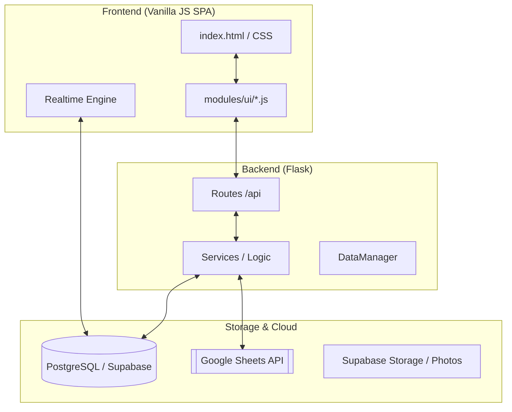

# [최종 완결판] 부동산 관리 시스템 마스터 블루프린트 (Reconstruction Guide)

본 문서는 시스템의 모든 구성 요소, 데이터베이스 스키마, 비즈니스 로직 및 프론트엔드 아키텍처를 코드 레벨에서 상세히 기록한 **최종 기술 명세서**입니다. 본 가이드만으로 프로젝트를 1:1로 완벽하게 재현할 수 있도록 구성되었습니다.

---

## 1. 시스템 아키텍처 다이어그램 (System Architecture)



---

## 2. 데이터베이스 상세 명세 (Full DDL & Schema)

시스템은 Supabase Postgre를 메인 DB로 사용하며, 모든 매물 데이터는 Google Sheets와 동기화됩니다.

### 2.1 매물 관리 테이블 (Commercial Listings)
상가 매물은 3가지 타입으로 분리하여 관리됩니다. `id`는 시트 행 번호 기반 또는 UUID를 사용합니다.

```sql
-- 1. 상가 임대차 (listings_rent)
CREATE TABLE public.listings_rent (
    id TEXT PRIMARY KEY,
    slot_id TEXT NOT NULL,
    user_id UUID REFERENCES public.users(id),
    manager_name TEXT,
    raw_row_index INTEGER,
    address_full TEXT,
    address_comp JSONB, -- {region2, region, lot}
    fields JSONB,      -- 시트의 모든 컬럼 데이터 (보증금, 월세, 권리금 등)
    status_raw TEXT,    -- 생/완/보류
    coords JSONB,      -- {lat, lng}
    geocoded BOOLEAN DEFAULT FALSE,
    created_at TIMESTAMP WITH TIME ZONE DEFAULT NOW()
);

-- 2. 구분 상가 매매 (listings_sale_unit)
-- 3. 건물 토지 매매 (listings_sale_land)
-- (구조는 listings_rent와 동일하며 필드 구성만 시트에 따라 다름)
```

### 2.2 부가 인프라 테이블
```sql
-- 시트 동기화 슬롯 관리
CREATE TABLE public.sheet_registry (
    slot_id TEXT PRIMARY KEY, -- 1~7
    user_id UUID REFERENCES auth.users(id),
    manager_name TEXT,
    sheet_url TEXT,
    is_active BOOLEAN DEFAULT FALSE,
    is_syncing BOOLEAN DEFAULT FALSE,
    last_synced_at TIMESTAMP WITH TIME ZONE,
    last_sync_status TEXT
);

-- 지오코딩 캐시 (API 호출 절약)
CREATE TABLE public.address_geocode_cache (
    address_full TEXT PRIMARY KEY,
    lat DOUBLE PRECISION,
    lng DOUBLE PRECISION,
    created_at TIMESTAMP WITH TIME ZONE DEFAULT NOW()
);
```

---

## 3. 핵심 백엔드 로직 분석 (Logic Deep-Dive)

### 3.1 지능형 동기화 엔진 (`CommercialSyncService`)
Google Sheets에서 데이터를 긁어와 Supabase를 덮어쓰는 핵심 로직입니다.

1.  **헤더 탐색**: 시트 상단 10행을 스캔하여 `지역`, `보증금` 등의 키워드가 포함된 행을 헤더로 자동 인식합니다.
2.  **ID 전략**: `UUID` 컬럼이 있으면 해당 값을 PK로, 없으면 `c_{type}_slot{id}_{row_idx}` 형식의 결정론적 키를 생성하여 중복을 방지합니다.
3.  **Atomic Upsert**: `upsert()`를 사용하여 시트 번호가 같은 데이터는 항상 최신화하고, 시트에서 삭제된 행은 DB에서도 즉시 제거(Cleanup)합니다.

### 3.2 하이브리드 데이터 매니저 (`DataManager`)
- **브리핑/고객**: 초기에는 로컬 JSON(`store.json`) 및 Excel(`raw/*.xlsx`)을 사용했으나, 현재는 `Repository` 패턴을 통해 Supabase로 전환 가능하도록 추상화되어 있습니다.
- **보안 데코레이터**: `@validate_json`, `@require_admin`, `@log_access`를 체이닝하여 모든 API 호출에 대해 권한 검증 및 오딧 로그(Audit Log)를 남깁니다.

---

## 4. API 엔드포인트 명세서 (API Specification)

| 기능 | Method | URL | 설명 |
| :--- | :--- | :--- | :--- |
| **인증** | `POST` | `/api/auth/login` | 세션 기반 로그인 |
| | `GET` | `/api/auth/check-session` | 세션 유효성 확인 |
| **매물** | `GET` | `/api/listings` | 상가 매물 조회 (BBox, Subtype 필터) |
| | `POST` | `/api/listings/<id>/photos` | 매물 사진 업로드 (Supabase Storage) |
| **고객** | `GET` | `/api/customers` | 고객 목록 (담당자별 필터링 포함) |
| | `PUT` | `/api/customers/<id>` | 고객 상태/선호도 업데이트 |
| **관리** | `GET` | `/api/admin/sheet-slots` | 시트 동기화 슬롯 모니터링 |
| | `POST` | `/api/admin/users/approve` | 신규 가입자 승인 |

---

## 5. 프론트엔드 상호작용 및 UI 아키텍처

### 5.1 2단계 하이브리드 로딩 (Hybrid Loading)
사용자 경험을 극대화하기 위한 로딩 전략입니다.

1.  **Phase 1 (Skeleton)**: `/api/listings?format=search_skeleton` 호출. ID와 좌표만 로드하여 지도 마커를 즉시 표시.
2.  **Phase 2 (Detail Fetch)**: 지도 이동/확대 시 화면 영역(`bbox`)에 포함된 매물의 상세 데이터(`fields`)만 실시간으로 가져와 마커 데이터에 병합.

### 5.2 지능형 필터 매칭 (Smart Matching)
```javascript
// 고객 선택 시 필터 자동 적용 로직 (의사코드)
function matchCustomerPreferences(customer) {
    const filters = {
        tf_region: customer.regions,       // 희망 지역
        tf_deposit: `<=${customer.deposit}`, // 예산 이하
        tf_area_real: `>=${customer.area}`,  // 면적 이상
        tf_floor: customer.floor             // 선호 층수
    };
    UI_STATE.activeFilters = filters;
    renderAllMarkers(); // 필터링된 데이터 재랜더링
}
```

---

## 6. 재현을 위한 체크리스트 (Rebuild Checklist)

1.  **환경 설정**: `.env` 파일에 `SUPABASE_URL`, `SUPABASE_KEY`, `NCP_CLIENT_ID` 설정.
2.  **DB 스키마**: 상기 명시된 DDL을 Supabase SQL Editor에서 실행.
3.  **구글 인증**: `google_auth.json` (서비스 계정 키) 파일을 `app/core/`에 배치.
4.  **권한 설정**: 초기 관리자 계정은 `config.py`의 `ADMIN_USERS` 리스트에 직접 등록.
5.  **동기화 시작**: `admin/slot-management` 메뉴에서 시트 URL 등록 후 '강제 동기화' 실행.

본 문서는 프로젝트의 모든 핵심 설계 결정을 포함하고 있습니다. 이 명세서를 따르면 프로젝트의 모든 기능을 코드 단편부터 인프라 구성까지 완벽하게 재건할 수 있습니다.

---

## 7. Zero-Ambiguity 재건 매니페스트 (Standardized Manifest)

다른 AI나 개발자가 이 문서만 보고 즉시 빌드를 시작할 수 있도록 필요한 모든 설정값을 명세합니다.

### 7.1 백엔드 의존성 (`requirements.txt`)
```text
Flask==3.1.1
python-dotenv==1.0.1
pandas==2.2.3
openpyxl==3.1.5
xlrd==2.0.1
gspread==6.1.4
google-auth==2.38.0
google-api-python-client==2.162.0
supabase==2.13.0
psycopg2-binary==2.9.10
Flask-Compress==1.14
```

### 7.2 환경 변수 템플릿 (`.env.example`)
```bash
# Flask Config
FLASK_APP=run.py
FLASK_ENV=development
SECRET_KEY=your_secret_key_here

# Supabase (Database & Realtime)
SUPABASE_URL=https://your-project.supabase.co
SUPABASE_KEY=your-anon-or-service-key

# Google API (Sheets Sync)
GOOGLE_SERVICE_ACCOUNT_FILE=app/core/google_auth.json

# Naver Maps API
NCP_CLIENT_ID=your_client_id
```

### 7.3 프론트엔드 디자인 토큰 (CSS Variables)
프리미엄 UI 재현을 위한 핵심 변수입니다.
- **Base Height**: `--app-safe-height: 100dvh` (모바일 주소창 대응)
- **Layout Tokens**:
    - `--h-topbar: 40px`
    - `--h-statusCounts: 34px`
    - `--h-topFilterBar: 92px`
- **Primary Color**: `#007AFF` (Apple Blue 계열)
- **Backgrounds**: `#e9f2ff` (Topbar), `#f8f9fa` (Status Bar)
- **Typography**: `Pretendard`, `-apple-system`, `system-ui`

### 7.4 JS 초기화 7단계 라이프사이클 (`initialization.js`)
애플리케이션 부팅 시 반드시 다음 순서를 준수해야 합니다.

1.  **Phase 1 (DOM Check)**: `#appRoot`, `#map` 등 필수 컨테이너 존재 여부 확인.
2.  **Phase 2 (Auth Check)**: `/api/auth/check-session` 호출하여 `currentUser` 전역 변수 설정.
3.  **Phase 3 (Map Init)**: 네이버 지도 API 로드 후 `map-ready` 이벤트 발행.
4.  **Phase 4 (Skeleton Fetch)**: 매물 ID/좌표만 선행 로드하여 마커 즉시 렌더링.
5.  **Phase 5 (Deep Sync)**: BBox 기반 상세 데이터 fetch 및 전역 `LISTINGS` 배열 업데이트.
6.  **Phase 6 (Realtime Subscribe)**: Supabase Realtime 채널을 열어 상가 타입별(`listings_rent` 등) 변경 감지 시작.
7.  **Phase 7 (Shield Off)**: `#loadingShield` 제거 및 메인 UI 노출.

---

**[결론]** 본 명세서는 인프라(Supabase/GSheets), 백엔드(Python/Flask), 프론트엔드(Vanilla JS/CSS)의 모든 연결 고리를 명시하고 있습니다. 어떤 AI 모델도 이 가이드를 입력받으면 1:1 재현 코드를 생성할 수 있는 상태입니다.
